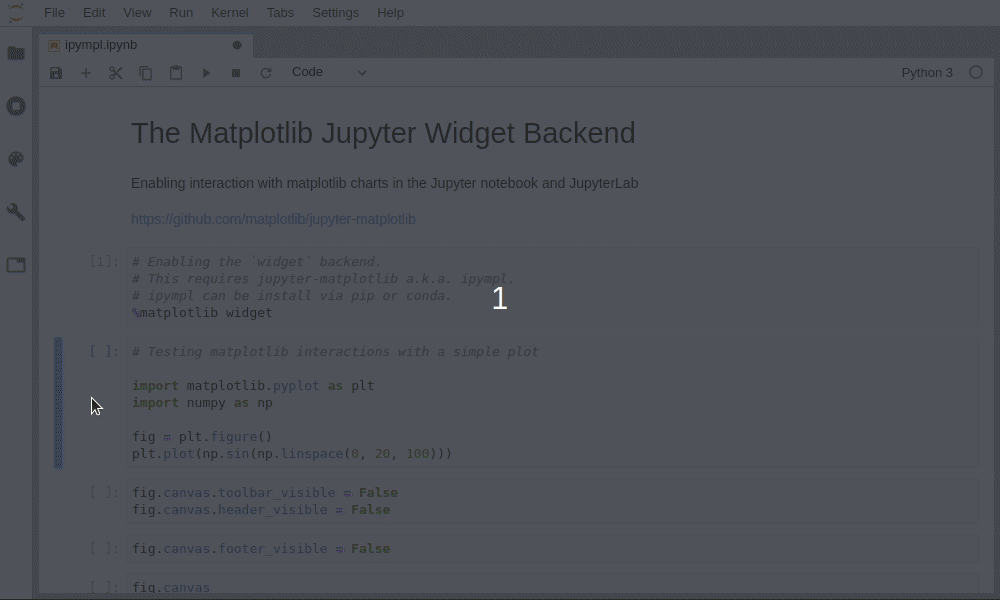

# jupyter-matplotlib

[](https://pypi.python.org/pypi/ipympl)
[](https://mybinder.org/v2/gh/matplotlib/jupyter-matplotlib/stable?filepath=examples)
[](https://gitter.im/jupyter-widgets/Lobby?utm_source=badge&utm_medium=badge&utm_campaign=pr-badge&utm_content=badge)

Leveraging the Jupyter interactive widgets framework, jupyter-matplotlib
enables the interactive features of matplotlib in the Jupyter notebook and in
Jupyterlab.

Besides, the figure `canvas` element is a proper Jupyter interactive widget
which can be positioned in interactive widget layouts.

## Usage

To enable the jupyter-matplotlib backend, simply use the `matplotlib` Jupyter
magic:

```
%matplotlib widget
```

## Example



## Installation

To install `ipympl` with conda:

```bash
conda install -c conda-forge ipympl

# If using the Notebook
conda install -c conda-forge widgetsnbextension

# If using JupyterLab
conda install nodejs
jupyter labextension install @jupyter-widgets/jupyterlab-manager
jupyter labextension install jupyter-matplotlib
```

To install `ipympl` with pip:

```bash
pip install ipympl

# If using JupyterLab
# Install nodejs: https://nodejs.org/en/download/
jupyter labextension install @jupyter-widgets/jupyterlab-manager
jupyter labextension install jupyter-matplotlib
```

For a development installation (requires node),

```bash
git clone https://github.com/matplotlib/jupyter-matplotlib.git
cd jupyter-matplotlib
pip install -e .
jupyter nbextension install --py --symlink --sys-prefix ipympl
jupyter nbextension enable --py --sys-prefix ipympl
jupyter labextension install @jupyter-widgets/jupyterlab-manager --no-build
jupyter labextension link ./js
cd js && npm run watch
# Launch jupyterlab as `jupyter lab --watch` in another terminal
```

